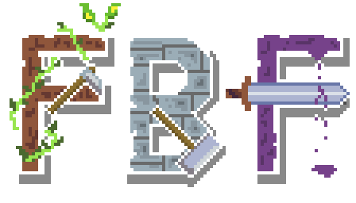



## Play the Game
*Farm, Build, Fight!* is playable on both PC and mobile devices. Start your adventure anytime, anywhere!

Dive into the survival RPG experience: [Play Farm, Build, Fight!](https://farmbuildfight.click)

(You can also download .exe file for windows here: [WindowsEXE/FBF.exe](https://github.com/Dvir545/AWS-game-challenge/tree/main/WindowsEXE) )

## Learn More
- **Devpost Project Page**: Discover the development journey and features: [FBF on Devpost](https://devpost.com/software/fbf-farm-build-fight)
- **AWS Community Blog Post**: Read about how the game was built and the technologies used: [Farm, Build, Fight! on AWS Community](https://community.aws/content/2rDju24YVMQzFIiI3OJVMlCGAO3/farm-build-fight-the-survival-rpg-you-never-knew-you-need)

## About the Game
In *Farm, Build, Fight!*, you’ll take on the role of a survivor on a deserted island. Farm crops, build defenses, and fight off increasingly challenging enemies. With an engaging day-night cycle and AI-driven NPCs offering tips, every decision matters as you strive to survive longer than ever before!

Enjoy the challenge and have fun! 🌱🏰⚔️

## Credits
(all sources used are under commercially royalty-free licence)

* Most visual assets by Kenmi
* Virtual Mobile Keyboard by Lilly Games
* Gamer font by memesbruh03
* SFX by pixabay
* Background Music by Suno.ai 

Made by Ohad Klein and Dvir Klein

*This game was made for and submitted to the AWS Game-Builder Challenge 2025*
